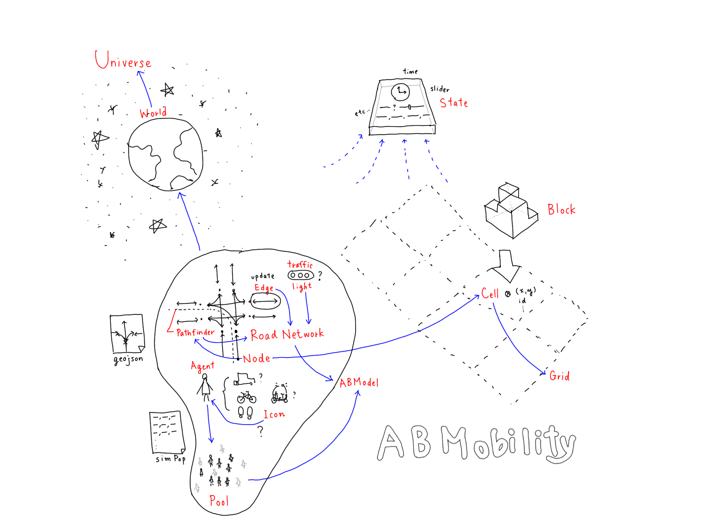

# ABMobility

## class schema

## Generating RoadNetwork geojson files

I'm using https://gist.github.com/yasushisakai/2316d0ff2996b3d42f916df519c83886,
to convert a rhino line file to a geojson. Note that the curve's start and end point (direction)
matters in car and bike lanes.
